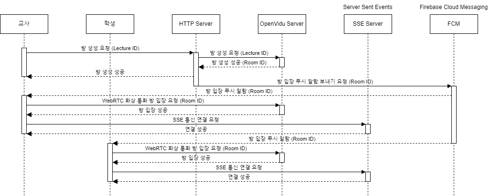
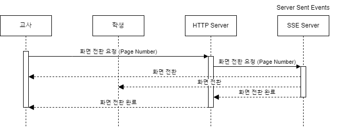

# 20230727 회고록

| 완료된 기획으로 각자 API 명세서, 목업 등을 완성하는 중입니다. 또한, 내일 있을 발표에 대해 자료를 완성하고 있습니다.

```
서버 아키텍쳐 고민을 깊게 수행하였습니다.

기존에는 소켓 통신을 활용해 진행하려 했으나, 굳이 데이터가 양방향으로 소통할 이유가 없다고 생각했습니다.
그래서 SSE(Server Sent Events) 통신 방법을 선택하였고, 이로 인해 HTTP 서버와 분리할 필요가 있다고 생각했습니다.
이러한 고민들을 통해 서버 아키텍처를 확정할 수 있었고, 서비스 흐름도를 만들 수 있었습니다.
```

### 작업 내용






### 집에서 할 일

* 발표 자료 마무리하기

* Project 초기 생성
