# 🏫 주경야학 (SSAFY 9기 부울경 E206 Hot6)

<br/>

<div align=center>
<br/>
  
</div>

<div align="center">
  <h3>기초교육을 받지 못한 어르신들을 위한 온라인 문해교실 서비스</h3>
</div>

<div align="right"><a href="https://www.youtube.com/watch?v=TiaQBOIdMIw">🎥 UCC 보러 가기</a></div>
<br/>

## ⌨️ 기간
- **2023.07.04 ~ 2023.08.18(7주)**

<a name="tableContents"></a>

<br/>

## 🔎 목차

1. <a href="#subject">🎯 주제</a>
1. <a href="#mainContents">⭐️ 주요 기능</a>
1. <a href="#systemArchitecture">⚙ 시스템 아키텍쳐</a>
1. <a href="#skills">🛠️ 기술 스택</a>
1. <a href="#directories">🗂️ 파일 구조</a>
1. <a href="#erd">💾 ERD</a>
1. <a href="#contents">🖥️ 화면 소개</a>
1. <a href="#developers">👥 팀원 소개</a>

<br/>

<!------- 주제 시작 -------->
## 🎯 주제
<a name="subject"></a>

**주경 야학**은 몸이 불편하거나 근처에 야학이 없어서 기존 야학에 참여하지 못하는 어르신들을 위한 편리한 교육 플랫폼입니다.

공간적 제약을 해소함으로써 더 많은 어르신에게 교육의 기회를 제공하고, 봉사자의 진입 장벽을 낮추는 것을 목표로 합니다.

**주요 기능:**
- 실시간 수업
- 개별 학습 지원
- 대화를 통한 일기 쓰기 학습

<div align="right"><a href="#tableContents">목차로 이동</a></div>

<br/>

<!------- 주요 기능 시작 -------->
## ⭐️ 주요 기능
<a name="mainContents"></a>

### 혼자 공부

<h4> 실시간 수업이 종료되면, 학생에게 숙제가 부여됩니다.</h4>

- 학생은 **혼자 공부**에서 받아쓰기, 읽기, 일기 생성, 생성된 일기 읽기를 할 수 있습니다.

<h4>학생의 혼자 공부에서 사용자와 상호작용을 높이기 위해 음성 기반으로 문답을 제공합니다.</h4>

- Speech-To-Text(STT)로 사용자의 발화를 text로 변환해 정답 판별합니다.
- Text-To-Speech(TTS)로 사용자에게 문제를 읽어주고, 피드백 제공합니다.
- Optimal Character Recognition(OCR)로 이미지에 있는 글자를 판별해 받아쓰기 정답을 체크합니다.
- Kakao의 Karlo를 활용해, 학생이 생성한 일기를 그림으로 변환해서 그림일기를 제공합니다.

### 실시간 수업

<h4>실시간 교육 기능을 통해 학생들에게 더욱 활발하고 직접적인 교육 경험을 제공합니다.</h4>
<h4>선생님이 반을 선택하여 강의를 생성합니다.</h4>

- 현재 접속 중인 학생들은 SSE 통신을 통해 실시간 알림을 받아 강의 페이지로 자동 이동합니다.
- 앞으로 로그인하는 학생들은 실시간 강의 여부에 따라 강의 페이지로 자동 이동합니다.

<h4>실시간 강의에서는 단순한 화상 통화를 넘어, 다양한 보조 기능들을 통해 효과적인 교육을 지원합니다.</h4>

- 선생님의 마우스 포인터 위치를 실시간으로 학생들에게 보여주는 마우스 트레이싱 기능이 탑재되어 있어, 학생들이 선생님의 지시를 쉽게 파악할 수 있습니다.
- 선생님이 학생의 페이지를 원격으로 제어하거나, 자신의 페이지 이동을 학생에게도 동기화시켜 수업의 질을 높입니다.
- 선생님이 학생들의 마이크를 제어하여 수업이 원활하게 진행 될 수 있습니다.

<div align="right"><a href="#tableContents">목차로 이동</a></div>

<br/>

<!------- 시스템 아키텍쳐 시작 -------->
## ⚙ 시스템 아키텍쳐
<a name="systemArchitecture"></a>


<div align="right"><a href="#tableContents">목차로 이동</a></div>

<br/>

<!------- 기술 스택 시작 -------->
## 🛠️ 기술 스택
<a name="skills"></a>

### 프론트


---

### 백엔드


---

### 협업


<div align="right"><a href="#tableContents">목차로 이동</a></div>

<br/>

<!------- 파일 구조 시작 -------->
## 🗂️ 파일 구조
<a name="directories"></a>

### 프론트
<details>
  <summary>
    자세히
  </summary>

```
📦frontend
 ┣ 📂openCV
 ┣ 📂public
 ┃ ┣ 📂images
 ┣ 📂src
 ┃ ┣ 📂assets
 ┃ ┃ ┣ 📂fonts
 ┃ ┃ ┗ 📂images
 ┃ ┣ 📂components
 ┃ ┣ 📂models
 ┃ ┣ 📂pages
 ┃ ┃ ┣ 📂Common
 ┃ ┃ ┃ ┣ 📂api
 ┃ ┃ ┃ ┣ 📂hooks
 ┃ ┃ ┣ 📂Government
 ┃ ┃ ┃ ┣ 📂ClassPage
 ┃ ┃ ┃ ┣ 📂components
 ┃ ┃ ┃ ┃ ┣ 📂Modal
 ┃ ┃ ┃ ┃ ┃ ┣ 📂AddStudyClass
 ┃ ┃ ┃ ┃ ┃ ┗ 📂StudentModal
 ┃ ┃ ┃ ┣ 📂MainPage
 ┃ ┃ ┃ ┣ 📂StudentPage
 ┃ ┃ ┃ ┣ 📂TeacherPage
 ┃ ┃ ┣ 📂Live
 ┃ ┃ ┣ 📂Student
 ┃ ┃ ┃ ┣ 📂my_model
 ┃ ┃ ┗ 📂Teacher
 ┃ ┣ 📂store
 ┃ ┃ ┣ 📂actions
 ┃ ┃ ┣ 📂reducers
 ┣ 📜.gitignore
 ┣ 📜Dockerfile
 ┣ 📜nginx.conf
 ┣ 📜package-lock.json
 ┣ 📜package.json
 ┗ 📜README.md
```
</details>

### 백엔드 서버 - 메인 서버
<details>
  <summary>
    자세히
  </summary>

```
📦http
 ┣ 📂src
 ┃ ┣ 📂main
 ┃ ┃ ┣ 📂java
 ┃ ┃ ┃ ┗ 📂com
 ┃ ┃ ┃ ┃ ┗ 📂ssafy
 ┃ ┃ ┃ ┃ ┃ ┗ 📂http
 ┃ ┃ ┃ ┃ ┃ ┃ ┣ 📂apis
 ┃ ┃ ┃ ┃ ┃ ┃ ┃ ┣ 📂auth
 ┃ ┃ ┃ ┃ ┃ ┃ ┃ ┃ ┣ 📂controllers
 ┃ ┃ ┃ ┃ ┃ ┃ ┃ ┃ ┣ 📂dtos
 ┃ ┃ ┃ ┃ ┃ ┃ ┃ ┃ ┣ 📂requests
 ┃ ┃ ┃ ┃ ┃ ┃ ┃ ┃ ┣ 📂responses
 ┃ ┃ ┃ ┃ ┃ ┃ ┃ ┃ ┗ 📂services
 ┃ ┃ ┃ ┃ ┃ ┃ ┃ ┣ 📂classes
 ┃ ┃ ┃ ┃ ┃ ┃ ┃ ┃ ┣ 📂controllers
 ┃ ┃ ┃ ┃ ┃ ┃ ┃ ┃ ┣ 📂entities
 ┃ ┃ ┃ ┃ ┃ ┃ ┃ ┃ ┣ 📂repositories
 ┃ ┃ ┃ ┃ ┃ ┃ ┃ ┃ ┣ 📂requests
 ┃ ┃ ┃ ┃ ┃ ┃ ┃ ┃ ┣ 📂responses
 ┃ ┃ ┃ ┃ ┃ ┃ ┃ ┃ ┗ 📂services
 ┃ ┃ ┃ ┃ ┃ ┃ ┃ ┣ 📂commoncodes
 ┃ ┃ ┃ ┃ ┃ ┃ ┃ ┃ ┣ 📂entities
 ┃ ┃ ┃ ┃ ┃ ┃ ┃ ┣ 📂deploy
 ┃ ┃ ┃ ┃ ┃ ┃ ┃ ┃ ┗ 📂controllers
 ┃ ┃ ┃ ┃ ┃ ┃ ┃ ┣ 📂diaries
 ┃ ┃ ┃ ┃ ┃ ┃ ┃ ┃ ┣ 📂controllers
 ┃ ┃ ┃ ┃ ┃ ┃ ┃ ┃ ┣ 📂entities
 ┃ ┃ ┃ ┃ ┃ ┃ ┃ ┃ ┣ 📂repositories
 ┃ ┃ ┃ ┃ ┃ ┃ ┃ ┃ ┣ 📂requests
 ┃ ┃ ┃ ┃ ┃ ┃ ┃ ┃ ┣ 📂responses
 ┃ ┃ ┃ ┃ ┃ ┃ ┃ ┃ ┗ 📂services
 ┃ ┃ ┃ ┃ ┃ ┃ ┃ ┣ 📂fcm
 ┃ ┃ ┃ ┃ ┃ ┃ ┃ ┃ ┣ 📂config
 ┃ ┃ ┃ ┃ ┃ ┃ ┃ ┃ ┣ 📂controllers
 ┃ ┃ ┃ ┃ ┃ ┃ ┃ ┃ ┗ 📂services
 ┃ ┃ ┃ ┃ ┃ ┃ ┃ ┣ 📂governments
 ┃ ┃ ┃ ┃ ┃ ┃ ┃ ┃ ┣ 📂controllers
 ┃ ┃ ┃ ┃ ┃ ┃ ┃ ┃ ┣ 📂entities
 ┃ ┃ ┃ ┃ ┃ ┃ ┃ ┃ ┣ 📂repositories
 ┃ ┃ ┃ ┃ ┃ ┃ ┃ ┃ ┣ 📂requests
 ┃ ┃ ┃ ┃ ┃ ┃ ┃ ┃ ┗ 📂services
 ┃ ┃ ┃ ┃ ┃ ┃ ┃ ┣ 📂homeworkhistories
 ┃ ┃ ┃ ┃ ┃ ┃ ┃ ┃ ┣ 📂controllers
 ┃ ┃ ┃ ┃ ┃ ┃ ┃ ┃ ┣ 📂entities
 ┃ ┃ ┃ ┃ ┃ ┃ ┃ ┃ ┣ 📂repositories
 ┃ ┃ ┃ ┃ ┃ ┃ ┃ ┃ ┣ 📂responses
 ┃ ┃ ┃ ┃ ┃ ┃ ┃ ┃ ┗ 📂services
 ┃ ┃ ┃ ┃ ┃ ┃ ┃ ┣ 📂lecture
 ┃ ┃ ┃ ┃ ┃ ┃ ┃ ┃ ┣ 📂controllers
 ┃ ┃ ┃ ┃ ┃ ┃ ┃ ┃ ┣ 📂requests
 ┃ ┃ ┃ ┃ ┃ ┃ ┃ ┃ ┗ 📂services
 ┃ ┃ ┃ ┃ ┃ ┃ ┃ ┣ 📂lecturehistories
 ┃ ┃ ┃ ┃ ┃ ┃ ┃ ┃ ┣ 📂controllers
 ┃ ┃ ┃ ┃ ┃ ┃ ┃ ┃ ┣ 📂entities
 ┃ ┃ ┃ ┃ ┃ ┃ ┃ ┃ ┣ 📂repositories
 ┃ ┃ ┃ ┃ ┃ ┃ ┃ ┃ ┗ 📂services
 ┃ ┃ ┃ ┃ ┃ ┃ ┃ ┣ 📂members
 ┃ ┃ ┃ ┃ ┃ ┃ ┃ ┃ ┣ 📂controllers
 ┃ ┃ ┃ ┃ ┃ ┃ ┃ ┃ ┣ 📂entities
 ┃ ┃ ┃ ┃ ┃ ┃ ┃ ┃ ┣ 📂repositories
 ┃ ┃ ┃ ┃ ┃ ┃ ┃ ┃ ┣ 📂requests
 ┃ ┃ ┃ ┃ ┃ ┃ ┃ ┃ ┣ 📂responses
 ┃ ┃ ┃ ┃ ┃ ┃ ┃ ┃ ┗ 📂services
 ┃ ┃ ┃ ┃ ┃ ┃ ┃ ┣ 📂mute
 ┃ ┃ ┃ ┃ ┃ ┃ ┃ ┃ ┗ 📂controllers
 ┃ ┃ ┃ ┃ ┃ ┃ ┃ ┣ 📂openvidu
 ┃ ┃ ┃ ┃ ┃ ┃ ┃ ┃ ┣ 📂controllers
 ┃ ┃ ┃ ┃ ┃ ┃ ┃ ┃ ┗ 📂requests
 ┃ ┃ ┃ ┃ ┃ ┃ ┃ ┣ 📂roles
 ┃ ┃ ┃ ┃ ┃ ┃ ┃ ┃ ┣ 📂entities
 ┃ ┃ ┃ ┃ ┃ ┃ ┃ ┗ 📂themes
 ┃ ┃ ┃ ┃ ┃ ┃ ┃ ┃ ┣ 📂controllers
 ┃ ┃ ┃ ┃ ┃ ┃ ┃ ┃ ┣ 📂entities
 ┃ ┃ ┃ ┃ ┃ ┃ ┃ ┃ ┣ 📂repositories
 ┃ ┃ ┃ ┃ ┃ ┃ ┃ ┃ ┣ 📂responses
 ┃ ┃ ┃ ┃ ┃ ┃ ┃ ┃ ┗ 📂services
 ┃ ┃ ┃ ┃ ┃ ┃ ┣ 📂exception
 ┃ ┃ ┃ ┃ ┃ ┃ ┃ ┣ 📂handler
 ┃ ┃ ┃ ┃ ┃ ┃ ┣ 📂jwt
 ┃ ┃ ┃ ┃ ┃ ┃ ┃ ┣ 📂dtos
 ┃ ┃ ┃ ┃ ┃ ┃ ┃ ┣ 📂filters
 ┃ ┃ ┃ ┃ ┃ ┃ ┣ 📂redis
 ┃ ┃ ┃ ┃ ┃ ┃ ┃ ┣ 📂configs
 ┃ ┃ ┃ ┃ ┃ ┃ ┃ ┗ 📂services
 ┃ ┃ ┃ ┃ ┃ ┃ ┣ 📂s3
 ┃ ┃ ┃ ┃ ┃ ┃ ┃ ┗ 📂configs
 ┃ ┃ ┃ ┃ ┃ ┃ ┣ 📂security
 ┃ ┃ ┃ ┃ ┃ ┃ ┃ ┣ 📂configs
 ┃ ┃ ┃ ┃ ┃ ┃ ┃ ┣ 📂services
 ┃ ┃ ┃ ┃ ┃ ┃ ┃ ┗ 📂utils
 ┃ ┃ ┃ ┃ ┃ ┃ ┣ 📂support
 ┃ ┃ ┃ ┃ ┃ ┃ ┃ ┣ 📂codes
 ┃ ┃ ┃ ┃ ┃ ┃ ┃ ┣ 📂responses
 ┃ ┃ ┃ ┃ ┃ ┃ ┃ ┗ 📂utils
 ┃ ┃ ┃ ┃ ┃ ┃ ┣ 📂swagger
 ┃ ┃ ┃ ┃ ┃ ┃ ┃ ┗ 📂configs
 ┃ ┃ ┗ 📂resources
 ┃ ┃ ┃ ┣ 📜application-db.yml
 ┃ ┃ ┃ ┣ 📜application-jwt.yml
 ┃ ┃ ┃ ┣ 📜application-openvidu.yml
 ┃ ┃ ┃ ┣ 📜application-redis.yml
 ┃ ┃ ┃ ┣ 📜application-s3.yml
 ┃ ┃ ┃ ┣ 📜application-sse.yml
 ┃ ┃ ┃ ┣ 📜application.yml
 ┃ ┃ ┃ ┣ 📜FCM_service_key.json
 ┃ ┃ ┃ ┣ 📜logback-local.properties
 ┃ ┃ ┃ ┗ 📜logback-spring.xml
 ┃ ┗ 📂test
 ┃ ┃ ┗ 📂java
 ┃ ┃ ┃ ┗ 📂com
 ┃ ┃ ┃ ┃ ┗ 📂ssafy
 ┃ ┃ ┃ ┃ ┃ ┗ 📂http
 ┃ ┃ ┃ ┃ ┃ ┃ ┣ 📂apis
 ┃ ┃ ┃ ┃ ┃ ┃ ┃ ┗ 📂members
 ┃ ┃ ┃ ┃ ┃ ┃ ┃ ┃ ┗ 📂services
 ┣ 📜.gitignore
 ┣ 📜build.gradle
 ┣ 📜classpath
 ┣ 📜Dockerfile
 ┣ 📜gradlew
 ┣ 📜gradlew.bat
 ┗ 📜settings.gradle
```

</details>

<div align="right"><a href="#tableContents">목차로 이동</a></div>

<br/>

<!------- ERD 시작 -------->

## 💾 ERD
<a name="erd"></a>


<div align="right"><a href="#tableContents">목차로 이동</a></div>

<br/>

<!------- 화면 소개 시작 -------->
<a name="contents"></a>

<br/>

## 🖥️ 화면 소개

### 1. 로그인 페이지
<div align=center>

</div>

  - face-api.js를 활용해 얼굴 로그인을 진행합니다.
  - 로그인은 박스 영역에 들어와야 로그인 진행이 됩니다.
  - 사용자가 박스 영역에 잘 들어올 수 있도록 TTS로 얼굴 이동을 안내합니다.

### 2. 교사 메인 페이지
<div align=center>
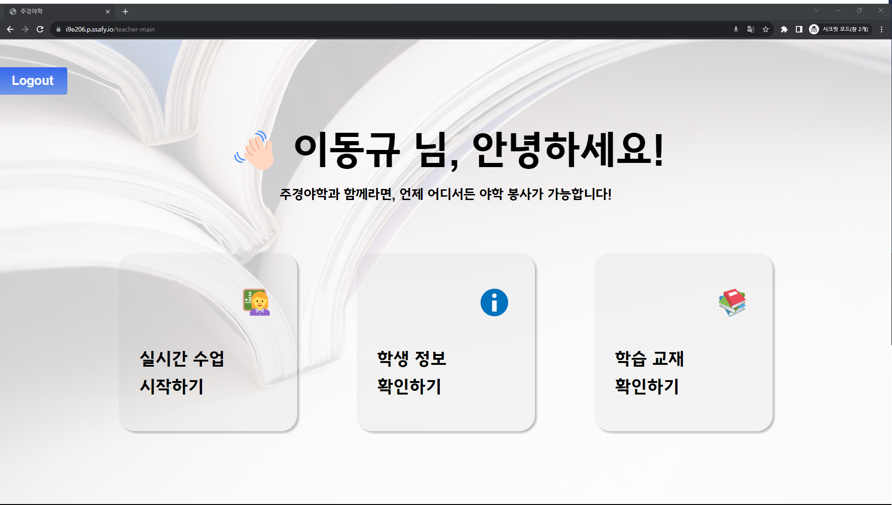
</div>

<h3>기능</h3>

  - 실시간 수업 시작
  - 야학 단체에 등록된 학생 확인
  - 학습 교재 확인

### 3. 교사 실시간 페이지
<h3>실시간 수업 시작</h3>
<div align=center>
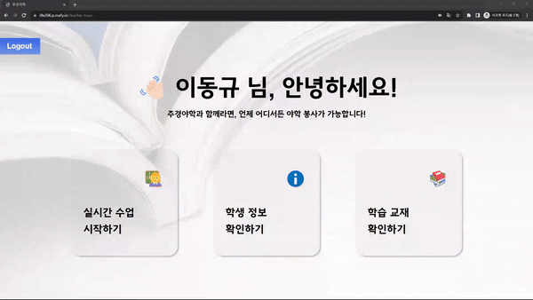
</div>

  - 수업을 시작을 누르면, 학생들은 실시간 수업으로 들어올 수 있습니다.


<h3>수업</h3>
<div align=center>

</div>

  - 수업을 위해 교사는 커리큘럼과 강의 자료를 선택합니다.
  - 강의자료 선택 후, 단어 읽기, 단어 받아쓰기 등의 수업을 진행합니다.

<h4>단어 읽기</h4>
<div align=center>
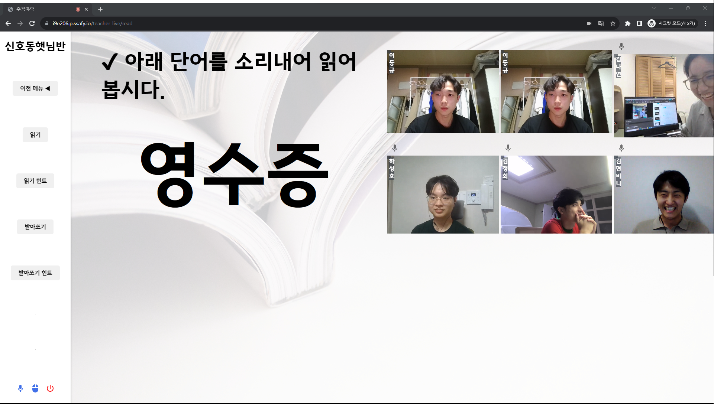
</div>
<h4>단어 힌트 - 단어 읽기 힘들어 할 경우</h4>
<div align=center>

</div>
<h4>단어 받아쓰기</h4>
<div align=center>
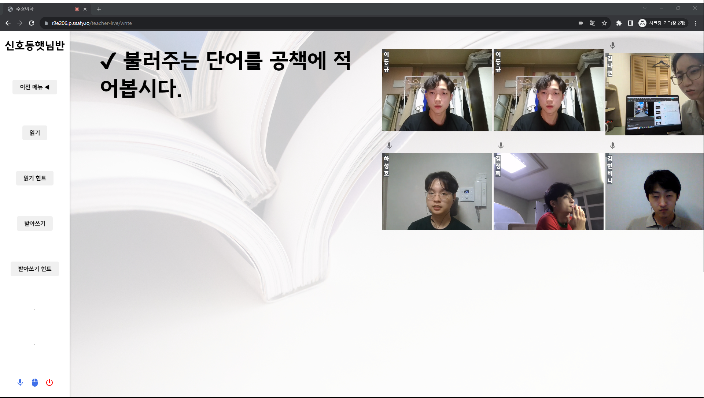
</div>

### 4. 학생 메인 페이지

<div align=center>
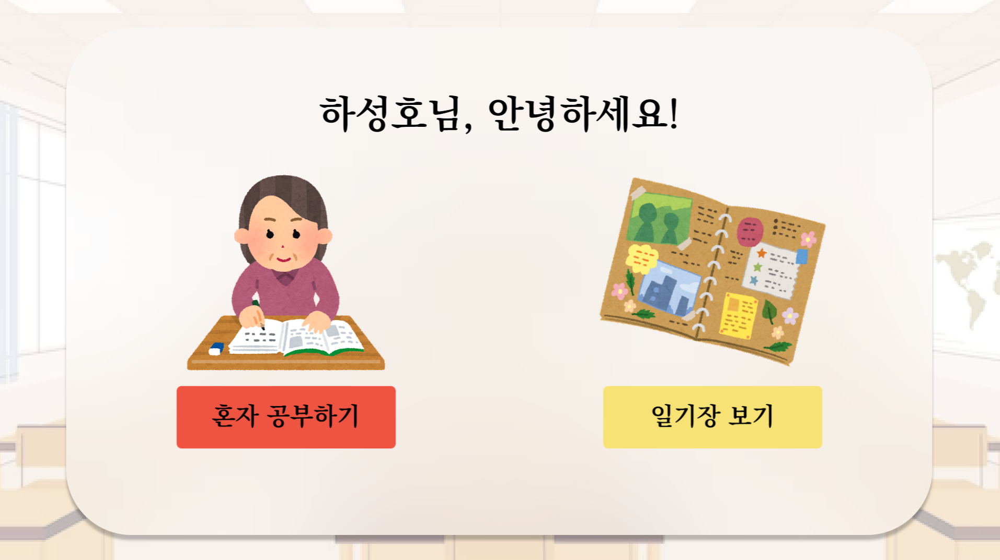
</div>

<h3>기능</h3>
  
  - 실시간 수업 : 강사가 방을 열었을 경우 자동 참여
  - 혼자 공부하기
  - 일기장 보기
  

### 5. 학생 실시간 페이지
<h3>실시간 수업 입장</h3>
<div align=center>

</div>

---
<div align=center>

</div>

  - 강사가 커리큘럼을 선택한다면 학생들의 화면에 교재가 띄워집니다.
  - 강사의 마우스가 학생들에게 포인터로 보이게 됩니다.

<h3>수업</h3>
<div align=center>

</div>

  - 학생들은 강사가 공유하는 교재를 보며 실시간 수업을 받습니다.
  - 단어 읽기, 받아쓰기 등의 수업이 진행됩니다.

<h4>단어 읽기</h4>
<div align=center>
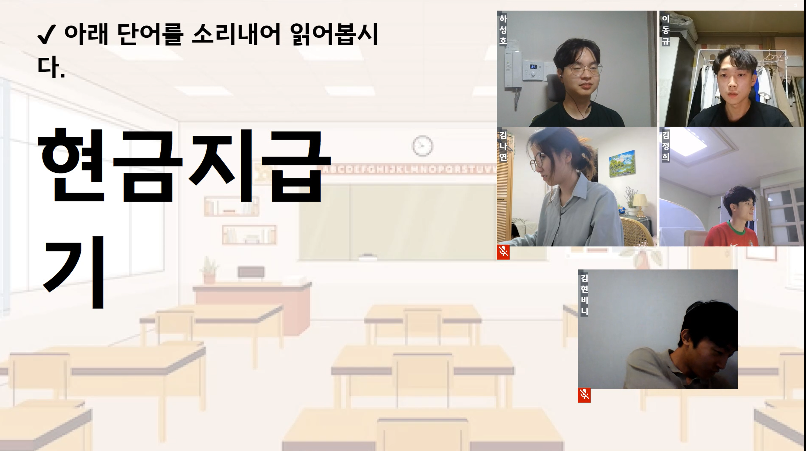
</div>
<h4>단어 힌트 - 단어 읽기 힘들어 할 경우</h4>
<div align=center>
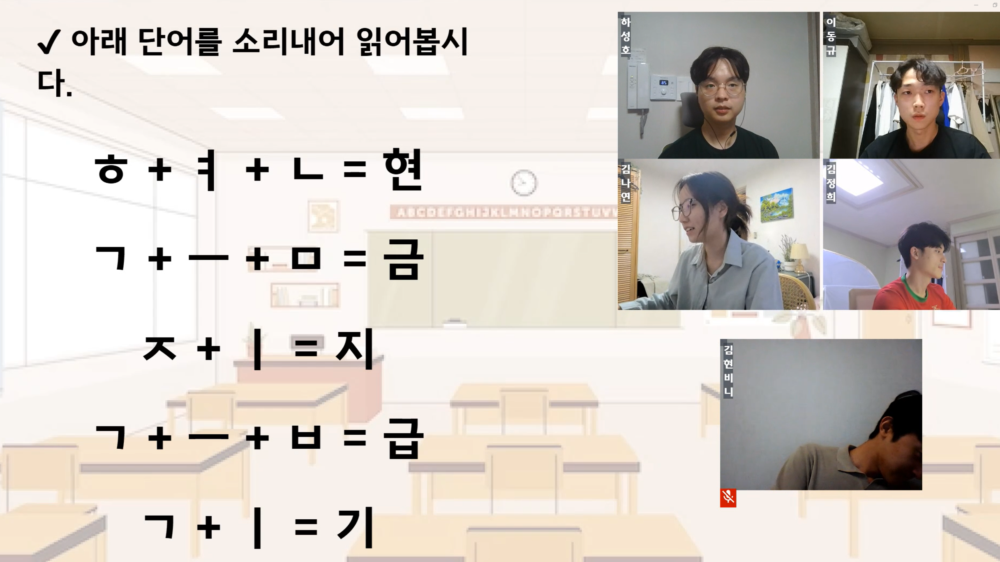
</div>
<h4>단어 받아쓰기</h4>
<div align=center>
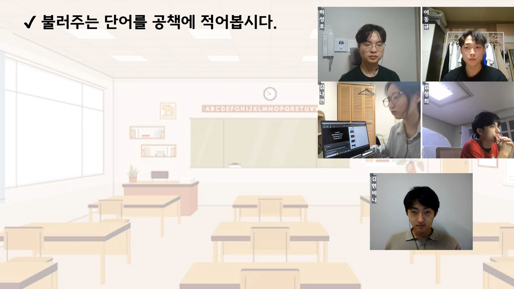
</div>

### 6. 혼자 공부하기
<div align=center>
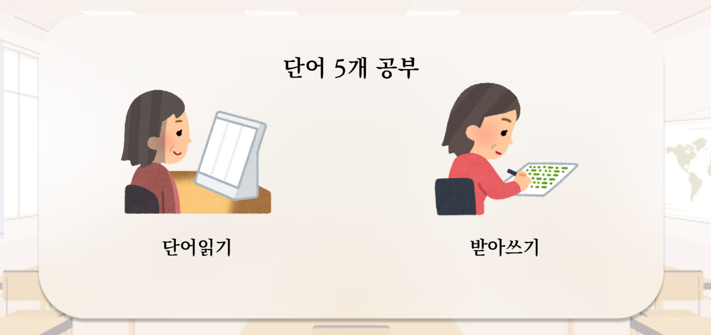
</div>

---

<div align=center>
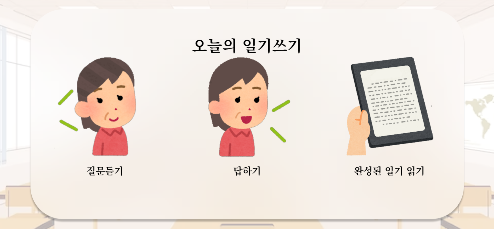
</div>

<h3>기능</h3>

  - 단어 읽고, 받아쓰기
  - 오늘의 일기 생성 및 읽기

---

<h4>단어 읽기</h4>
<div align=center>
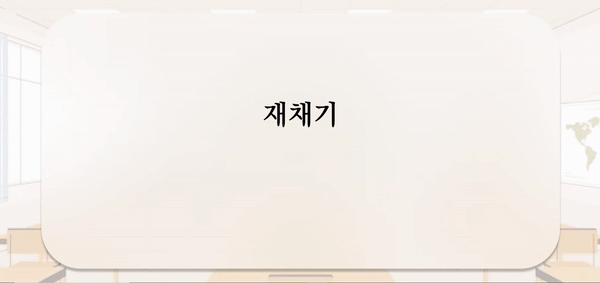
</div>

- 학생의 음성을 통해 정답 판별을 합니다.

<h4>공책 선택</h4>
<div align=center>
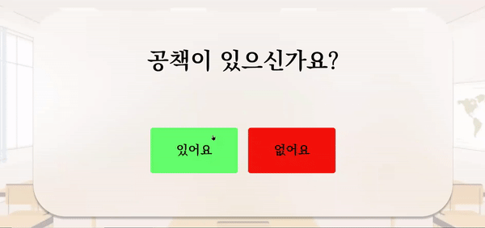
</div>


<h4>받아쓰기 - 공책 없음</h4>
<div align=center>

</div>

- 공책이 없는 경우, 캔버스를 통해서 받아쓰기를 할 수 있습니다.

<h4>받아쓰기 - 공책 있음</h4>
<div align=center>

</div>

- OCR을 통해 사진에 있는 text를 인식해 정답을 비교합니다.

---

<h4>일기 생성</h4>

<h4>생성된 일기로 읽기</h4>

### 7. 일기

<div align="right"><a href="#tableContents">목차로 이동</a></div>

<br/>

<!------- 팀원 소개 시작 -------->
## 👥 팀원 소개
<a name="developers"></a>

| **Name** | 이동규 | 김정희 | 하성호 | 김나연 | 김예진 | 김현빈 |
| :-----: | :-----: | :-----: | :-----: | :-----: | :-----: | :-----: |
| **Profile**  |  |   |         |   |       |   |
| **Position** |          Backend   <br/> Leader     |          Backend           |           Backend           |        Frontend         |            Frontend             |         Frontend         |
|   **Git**    | [GitHub](https://github.com/unit74) | [GitHub](https://github.com/JeongHuiKim) | [GitHub](https://github.com/seongho-98) | [GitHub](https://github.com/nayeonxkim) | [GitHub](https://github.com/yelunar) | [GitHub](https://github.com/HyeonBhinKim) |


<div align="right"><a href="#tableContents">목차로 이동</a></div>
