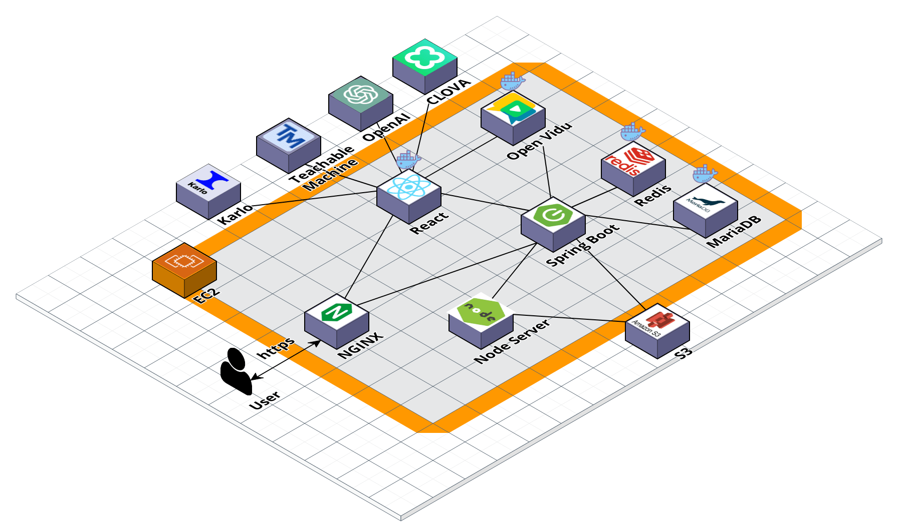
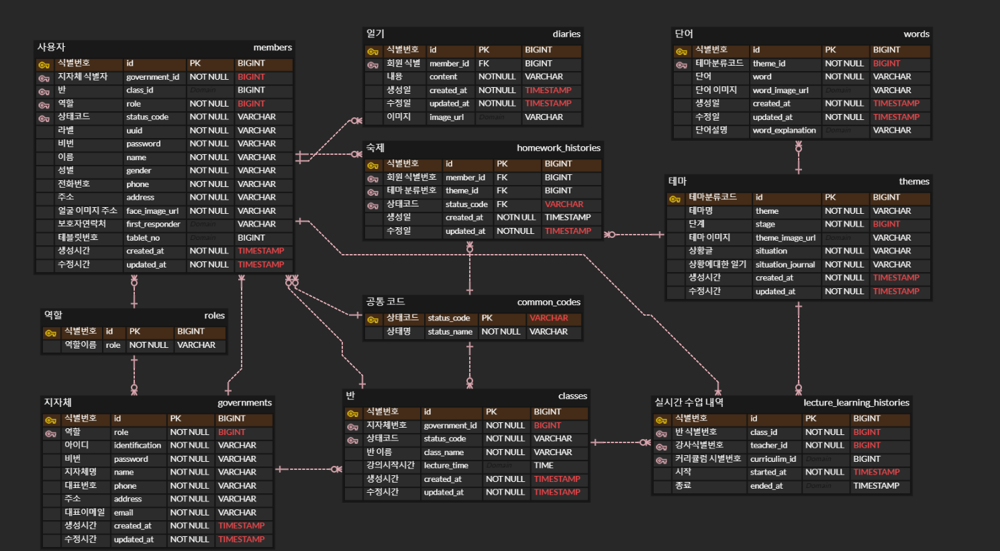

# 🏫 주경야학 (SSAFY 9기 부울경 E206 Hot6)

- 주경야학 로고나 이미지

  <h3>기초교육을 받지 못한 어르신들을 위한 온라인 문해교실 서비스</h3>

 

## ⌨️ 기간
- **2023.07.04 ~ 2023.08.18(7주)**

 

## 🔎 목차

1. <a href="#subject">🎯 주제</a>
1. <a href="#mainContents">⭐️ 주요 기능</a>
1. <a href="#systemArchitecture">⚙ 시스템 아키텍쳐</a>
1. <a href="#skills">🛠️ 기술 스택</a>
1. <a href="#directories">🗂️ 파일 구조</a>
1. <a href="#erd">💾 ERD</a>
1. <a href="#contents">🖥️ 화면 소개</a>
1. <a href="#developers">👥 팀원 소개</a>

 

<!------- 주제 시작 -------->
## 🎯 주제

몸이 불편하거나 근처에 야학이 없어서 기존 야학에 참여하지 못하는 어르신들을 위한 편리한 교육 플랫폼입니다.

공간적 제약을 해소함으로써 더 많은 어르신에게 교육의 기회를 제공하고, 봉사자의 진입 장벽을 낮추는 것을 목표로 합니다.

실시간 수업, 혼자 학습, 대화를 통한 일기 쓰기를 통한 학습을 제공합니다.

<a href="#tableContents">목차로 이동</a>

 

<!------- 주요 기능 시작 -------->
## ⭐️ 주요 기능

### 혼자 학습
- 혼자학습은 이렇고 저렇고 합니다
### 실시간 수업
- 실시간 수업은 이렇습니다

<a href="#tableContents">목차로 이동</a>

 

<!------- 시스템 아키텍쳐 시작 -------->
## ⚙ 시스템 아키텍쳐

<a href="#tableContents">목차로 이동</a>

 

<!------- 기술 스택 시작 -------->
## 🛠️ 기술 스택

### 프론트

---

### 백엔드

---

### 협업

<a href="#tableContents">목차로 이동</a>

 

<!------- 파일 구조 시작 -------->
## 🗂️ 파일 구조

### 프론트

### 백엔드 서버 - 메인 서버

### 백엔드 서버 - 얼굴 인식 서버

<a href="#tableContents">목차로 이동</a>

 

<!------- ERD 시작 -------->

## 💾 ERD

<a href="#tableContents">목차로 이동</a>

 

<!------- 화면 소개 시작 -------->

 

## 🖥️ 화면 소개

- 페이지별 GIF

<a href="#tableContents">목차로 이동</a>

 

<!------- 팀원 소개 시작 -------->
## 👥 팀원 소개

| **Name** | 이동규 | 김정희 | 하성호 | 김나연 | 김예진 | 김현빈 |
| :-----: | :-----: | :-----: | :-----: | :-----: | :-----: | :-----: |
| **Profile**  |  |   |         |   |       |   |
| **Position** |          Backend     Leader     |          Backend           |           Backend           |        Frontend         |            Frontend             |         Frontend         |
|   **Git**    | [GitHub](https://github.com/unit74) | [GitHub](https://github.com/JeongHuiKim) | [GitHub](https://github.com/seongho-98) | [GitHub](https://github.com/nayeonxkim) | [GitHub](https://github.com/yelunar) | [GitHub](https://github.com/HyeonBhinKim) |

<a href="#tableContents">목차로 이동</a>

